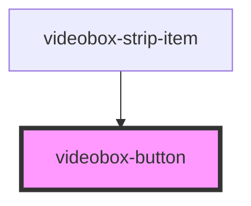

# videobox-button

<!-- Auto Generated Below -->

## Properties

| Property | Attribute | Description | Type     | Default     |
| -------- | --------- | ----------- | -------- | ----------- |
| `name`   | `name`    |             | `string` | `undefined` |

## Events

| Event           | Description | Type                  |
| --------------- | ----------- | --------------------- |
| `buttonClicked` |             | `CustomEvent<string>` |

## Dependencies

### Used by

 - [videobox-strip-item](../videobox-strip-item)

### Graph

----------------------------------------------

*Built with [StencilJS](https://stenciljs.com/)*
