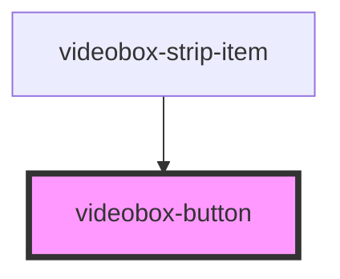

# videobox-button

<!-- Auto Generated Below -->

## Properties

| Property | Attribute | Description | Type               | Default     |
| -------- | --------- | ----------- | ------------------ | ----------- |
| `id`     | `id`      |             | `string`           | `undefined` |
| `type`   | `type`    |             | `"cart" \| "info"` | `undefined` |

## Events

| Event           | Description | Type                                             |
| --------------- | ----------- | ------------------------------------------------ |
| `buttonClicked` |             | `CustomEvent<{ type: ButtonType; id: string; }>` |

## Dependencies

### Used by

 - [videobox-strip-item](../videobox-strip-item)

### Graph

----------------------------------------------

*Built with [StencilJS](https://stenciljs.com/)*
