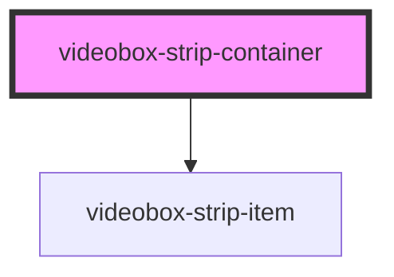

# videobox-strip-container

<!-- Auto Generated Below -->

## Properties

| Property | Attribute | Description | Type                                 | Default                                                                                                                                                                                                                                            |
| -------- | --------- | ----------- | ------------------------------------ | -------------------------------------------------------------------------------------------------------------------------------------------------------------------------------------------------------------------------------------------------- |
| `data`   | --        |             | `{ title: string; desc: string; }[]` | `[     { title: 'Dummy title #1', desc: 'desc' },     { title: 'Dummy title #2', desc: 'desc' },     { title: 'Dummy title #3', desc: 'desc' },     { title: 'Dummy title #4', desc: 'desc' },     { title: 'Dummy title #5', desc: 'desc' },   ]` |

## Dependencies

### Depends on

- [videobox-strip-item](../videobox-strip-item)

### Graph

----------------------------------------------

*Built with [StencilJS](https://stenciljs.com/)*
