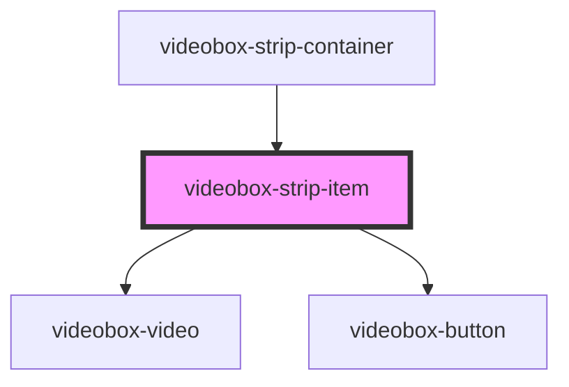

# videobox-strip-item

<!-- Auto Generated Below -->

## Properties

| Property | Attribute | Description | Type           | Default     |
| -------- | --------- | ----------- | -------------- | ----------- |
| `index`  | `index`   |             | `number`       | `undefined` |
| `item`   | --        |             | `VideoboxItem` | `undefined` |

## Dependencies

### Used by

 - [videobox-strip-container](../videobox-strip-container)

### Depends on

- [videobox-video](../videobox-video)
- [videobox-button](../videobox-button)

### Graph

----------------------------------------------

*Built with [StencilJS](https://stenciljs.com/)*
